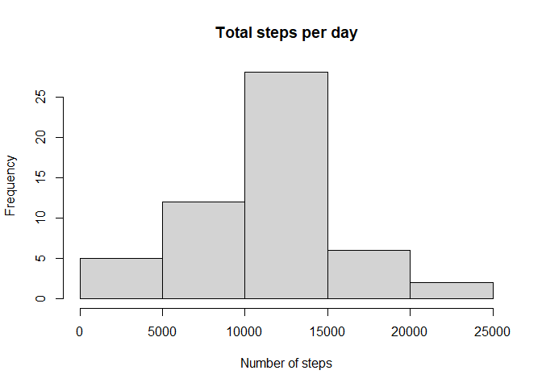
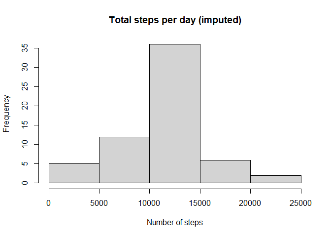
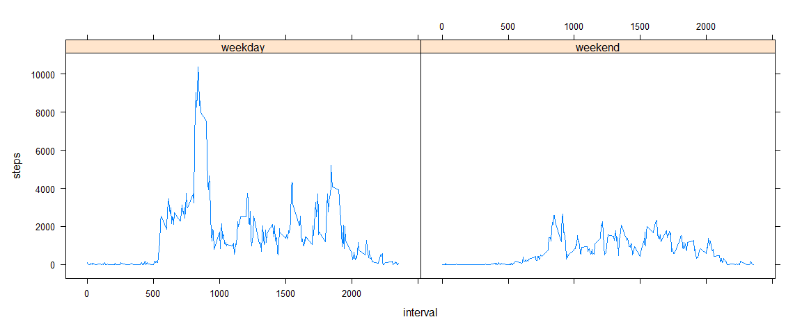

## Loading and preprocessing the data


```r
library(lubridate)
```

```
## 
## Attaching package: 'lubridate'
```

```
## The following objects are masked from 'package:base':
## 
##     date, intersect, setdiff, union
```

```r
library(dplyr)
```

```
## 
## Attaching package: 'dplyr'
```

```
## The following objects are masked from 'package:stats':
## 
##     filter, lag
```

```
## The following objects are masked from 'package:base':
## 
##     intersect, setdiff, setequal, union
```

```r
library(tidyr)

rawData <- read.csv("activity.csv")
processedData <- mutate(rawData,day = ymd(date),.keep = "unused", .before = "interval")
```

## What is mean total number of steps taken per day?


```r
pDatasummary <- processedData %>% group_by(day) %>% summarise(steps=sum(steps))
pDatasummaryC <- pDatasummary[complete.cases(pDatasummary),]
hist(pDatasummaryC$steps, main = "Total steps per day", xlab = "Number of steps")
```

<!-- -->

The mean number of steps taken per day is 


```r
mean(pDatasummaryC$steps)
```

```
## [1] 10766.19
```

The median number of steps taken per day is


```r
median(pDatasummaryC$steps)
```

```
## [1] 10765
```

## What is the average daily activity pattern?

```r
processedData <- processedData %>% group_by(interval)
pDatasummaryInterval <- summarise(processedData, steps=mean(steps, na.rm = TRUE))
pDatasummaryIntervalC <- pDatasummaryInterval[complete.cases(pDatasummaryInterval),]


library(ggplot2)
p <- ggplot(pDatasummaryIntervalC, aes(x=interval, y=steps))

p + geom_line() + labs(y = "Average steps across all days") + theme_classic()
```

<!-- -->


Across all days, the interval with the most number of steps on average is


```r
pDatasummaryIntervalC$interval[which.max(pDatasummaryIntervalC$steps)]
```

```
## [1] 835
```


## Imputing missing values


The total number of missing values is


```r
sum(is.na(processedData$steps))
```

```
## [1] 2304
```
Strategy to impute the missing data --> substitute the mean number of steps across all days for that 5-min interval. A new data set is created with the missing data filled in.


```r
processedDataImp <- processedData %>% left_join(pDatasummaryIntervalC, by ="interval") %>% mutate(steps = coalesce(steps.x,steps.y)) %>%select(steps,day,interval)
```


Histogram of imputed results 


```r
pDatasummaryImp <- processedDataImp %>% group_by(day) %>% summarise(steps=sum(steps))
hist(pDatasummaryImp$steps, main = "Total steps per day (imputed)", xlab = "Number of steps")
```

<!-- -->

After imputing the data, the mean number of steps taken per day is 


```r
mean(pDatasummaryImp$steps)
```

```
## [1] 10766.19
```

After imputing the data, the median number of steps taken per day is


```r
median(pDatasummaryImp$steps)
```

```
## [1] 10766.19
```

The mean of the imputed data is identical to that of the raw data. The median and mean of the imputed data but the median of the imputed data is different that that of the raw data. 

This makes sense since when data is missing, all the intervals are missing for the whole day. In other words, each day either has data for all the intervals or for non of them. Therefore, imputing on the interval level (which is done here) or on the day level will give the same result. 

## Are there differences in activity patterns between weekdays and weekends?


```r
weekend <- processedDataImp[weekdays(processedDataImp$day) %in% c("Saturday","Sunday"),]
weekday <- processedDataImp[!weekdays(processedDataImp$day) %in% c("Saturday","Sunday"),]

wdaySummaryInt <- weekday %>% group_by(interval) %>% summarise(steps=sum(steps))
wendSummaryInt <- weekend %>% group_by(interval) %>% summarise(steps=sum(steps))

combined <- left_join(wdaySummaryInt,wendSummaryInt,by = "interval", suffix = c("_weekday","_weekend"))
final <-pivot_longer(combined,starts_with("steps"),names_to = "type", names_prefix = "steps_",names_transform = list(type = as.factor), values_to = "steps")


library(lattice)

xyplot(steps~interval|type,data = final, type = "l")
```

<!-- -->

